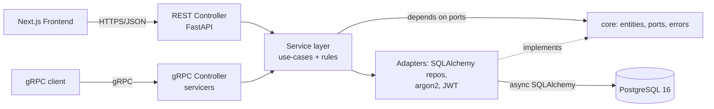

# 📚 Neighborhood Library System

An enterprise-grade service to manage a small library's **books, members, and lending
operations**, built with a **gRPC core + REST gateway** in Python over **PostgreSQL**, with a
**Next.js** web frontend. Designed to be secure, fast, scalable, and highly maintainable.

> Educational project — see [DISCLAIMER](./DISCLAIMER.md) and the [MIT License](./LICENSE).
> The living design document with decisions and progress is [CLAUDE.md](./CLAUDE.md).

---

## Table of contents

1. [What it does](#1-what-it-does)
2. [Tech stack](#2-tech-stack)
3. [Architecture & why](#3-architecture--why-it-was-adopted)
4. [Database design (ER diagram + sample SQL)](#4-database-design)
5. [Backend design & paradigm](#5-backend-design--paradigm)
6. [Frontend design & paradigm](#6-frontend-design--paradigm)
7. [Time & space complexity](#7-time--space-complexity)
8. [Security](#8-security)
9. [Scalability & load-test results](#9-scalability--load-test-results)
10. [Setup, run & test (tutorial)](#10-setup-run--test-tutorial)
11. [Feature walkthrough — check every feature](#11-feature-walkthrough--check-every-feature)
12. [API reference](#12-api-reference)

---

## 1. What it does

Library staff can:

- **Create/update books** and add **physical copies** of each title (with search + pagination).
- **Create/update members** (borrowers), with soft-delete.
- **Borrow** a copy for a member and **return** it.
- **Query** loans — a member's current books, active loans, overdue loans.
- Log in securely; all operations are authenticated and audited.

A book that is already checked out **cannot** be borrowed again — enforced at the database level.

---

## 2. Tech stack

| Layer | Technology | Why |
|-------|-----------|-----|
| Server | Python 3.12, **gRPC** (grpcio) + **FastAPI** REST gateway | gRPC = strongly-typed contract (assignment preference); REST = browser-friendly for the SPA |
| Data | **PostgreSQL 16**, SQLAlchemy 2 (async) + Alembic | Relational integrity + migrations; async for high concurrency |
| Auth | JWT (access + refresh) + RBAC, **argon2id** | Stateless, scalable auth; memory-hard hashing |
| Frontend | **Next.js 16** (App Router), TypeScript, Tailwind | Modern React, typed, fast DX |
| Infra | Docker Compose, GitHub Actions-ready | One-command reproducible local stack |

---

## 3. Architecture & why it was adopted

The codebase follows **Hexagonal Architecture (Ports & Adapters) + SOLID**, with a strict,
inward-pointing dependency flow:

```
main.py  →  controller  →  service  →  core (ports/entities)  ←  adapter
                                                                   ▲
support:  models · schemas · config · utils                        │
                             (adapters implement core ports; DI at main.py)
```



**Why this structure**

- **Single Responsibility** — controllers only translate transport ⇄ service; services hold
  business rules; repositories only persist. Each file changes for one reason.
- **Dependency Inversion** — `service` depends on **abstract ports** in `core`, never on
  concrete adapters. `main.py` (the composition root) injects the real adapters. This is why
  the same `AuthService`/`BookService`/`LoanService` power **both** the REST and gRPC
  controllers with zero duplication.
- **Testability** — because services depend on ports, they are unit-tested against
  **in-memory fakes** with no database. 63 tests run in < 1 second; 98% coverage on
  `service` + `core`.
- **Swappability (Open/Closed)** — swap PostgreSQL for another store, or argon2 for another
  hasher, by writing a new adapter — no change to business logic.

Layer directory map (`backend/src/library/`):

| Folder | Responsibility |
|--------|----------------|
| `main.py`, `main_grpc.py` | Composition roots / entrypoints (wire adapters into services) |
| `controller/rest`, `controller/grpc` | Transport adapters (routers / servicers) — translate only |
| `service/` | Use-cases: orchestration, transactions, business rules |
| `core/` | Pure domain: `entities`, `enums`, `errors`, `ports/` (abstract interfaces) |
| `adapter/db`, `adapter/security` | Concrete implementations of core ports |
| `models/` | SQLAlchemy ORM models (persistence) |
| `schemas/` | Pydantic DTOs (REST request/response) |
| `config/`, `utils/` | Settings + logging; cross-cutting helpers |

---

## 4. Database design

### 4.1 ER diagram

```mermaid
erDiagram
    STAFF_USERS ||--o{ LOANS : "processed_by"
    STAFF_USERS ||--o{ AUDIT_LOG : "actor"
    STAFF_USERS ||--o{ REFRESH_TOKENS : "owns"
    MEMBERS ||--o{ LOANS : "borrows"
    BOOKS ||--o{ BOOK_COPIES : "has copies"
    BOOK_COPIES ||--o{ LOANS : "lent as"
    LOANS ||--o{ FINES : "may incur"

    BOOKS { uuid id PK; text title; text author; text isbn UK; int published_year }
    BOOK_COPIES { uuid id PK; uuid book_id FK; text barcode UK; text status }
    MEMBERS { uuid id PK; text email UK; text status; timestamptz deleted_at }
    STAFF_USERS { uuid id PK; text email UK; text password_hash; text role }
    LOANS { uuid id PK; uuid copy_id FK; uuid member_id FK; timestamptz due_at; timestamptz returned_at }
    FINES { uuid id PK; uuid loan_id FK; numeric amount; text status }
    AUDIT_LOG { uuid id PK; uuid actor_staff_id FK; text action; jsonb metadata }
    REFRESH_TOKENS { uuid id PK; uuid staff_id FK; text token_hash UK; timestamptz revoked_at }
```

### 4.2 Design rationale

- **Per-physical-copy inventory** (`books` → `book_copies` → `loans`): a real library owns
  several copies of a title, and "already checked out" is a property of a *copy*, not a title.
- **Normalized (3NF):** titles, copies, members, and loan events are separate; no duplicated
  book/member data on loans.
- **The key integrity rule** — a copy can have at most one *open* loan — is enforced by the DB,
  not just app code, via a **partial unique index**:

  ```sql
  CREATE UNIQUE INDEX uq_active_loan_per_copy
    ON loans (copy_id) WHERE returned_at IS NULL;
  ```

  This makes double-borrow **impossible even under concurrent requests** — Postgres rejects the
  second insert. The borrow flow additionally takes a `SELECT … FOR UPDATE` row lock on the copy.
- **Data types:** UUID PKs (`gen_random_uuid()`), `timestamptz` (UTC) everywhere, money as
  exact `NUMERIC(10,2)` (never float), enums as VARCHAR + CHECK.
- **Indexes:** trigram GIN on `books.title/author` (fast `ILIKE` search), partial index on
  active loans per member, FK indexes. `updated_at` maintained by a trigger.
- **Soft delete** on `members` (preserves loan history); **audit_log** for accountability.

### 4.3 Sample SQL queries

```sql
-- All books a given member currently has out:
SELECT b.title, bc.barcode, l.borrowed_at, l.due_at
FROM loans l
JOIN book_copies bc ON bc.id = l.copy_id
JOIN books b        ON b.id = bc.book_id
WHERE l.member_id = :member_id AND l.returned_at IS NULL
ORDER BY l.due_at;

-- All overdue loans (still out, past due):
SELECT b.title, m.first_name || ' ' || m.last_name AS member, l.due_at
FROM loans l
JOIN book_copies bc ON bc.id = l.copy_id
JOIN books b        ON b.id = bc.book_id
JOIN members m      ON m.id = l.member_id
WHERE l.returned_at IS NULL AND l.due_at < now()
ORDER BY l.due_at;

-- Availability per title (total vs available copies):
SELECT b.title,
       count(bc.id)                                        AS total_copies,
       count(bc.id) FILTER (WHERE bc.status = 'available') AS available_copies
FROM books b
LEFT JOIN book_copies bc ON bc.book_id = b.id
GROUP BY b.id
ORDER BY b.title;

-- Fuzzy catalog search (uses the trigram GIN indexes):
SELECT id, title, author FROM books
WHERE title ILIKE '%clean%' OR author ILIKE '%martin%';
```

---

## 5. Backend design & paradigm

- **Contract-first, transport-agnostic:** the `.proto` files define the service contract;
  Python gRPC stubs are generated from them. Both gRPC servicers and REST routers are thin
  adapters over the same service layer — one source of truth for behavior.
- **Async everywhere** (FastAPI + async SQLAlchemy + asyncpg) — a single worker handles many
  concurrent requests while waiting on the database.
- **Dependency injection** at the composition root — services receive their ports via
  constructor; FastAPI `Depends` builds request-scoped services.
- **Central error mapping** — business code raises typed `DomainError`s; one place maps them to
  HTTP status codes and another to gRPC status codes (`NotFound`→404, `Conflict`→409/
  FAILED_PRECONDITION, `Validation`→400, `Unauthenticated`→401, `PermissionDenied`→403).
- **Explicit exception handling** — every failure path is typed and mapped; no bare `except`,
  no leaked stack traces; structured JSON logs carry a per-request id.

---

## 6. Frontend design & paradigm

- **Next.js App Router + TypeScript** — file-based routing, React 19, server-ready.
- **Typed API client** (`src/lib/api.ts`) mirrors the backend DTOs, centralizes auth headers
  and error translation (`ApiError`).
- **Auth context** (`src/lib/auth.tsx`) stores the JWT access token and exposes `login/logout`;
  pages redirect to `/login` when unauthenticated.
- **Client components** for interactive CRUD (forms + tables) using React hooks; Tailwind for
  styling. Pages: `/login`, `/books`, `/members`, `/loans`.
- **Why:** Next.js is the assignment's preferred framework; a typed client + context keeps the
  UI thin and consistent with the backend contract.

---

## 7. Time & space complexity

All heavy lifting is done by indexed PostgreSQL queries; application code is O(n) over the
**page** of results (default 20, max 100), never the whole table.

| Operation | Time complexity | Notes |
|-----------|-----------------|-------|
| Login | `O(1)` DB lookup by unique `email` (B-tree) + `O(1)` argon2 verify | argon2 is deliberately costly (CPU/memory), independent of table size |
| Create/Update book/member | `O(log n)` index insert/update + `O(1)` unique checks | RETURNING avoids extra round-trips |
| Get book/member by id | `O(log n)` PK lookup | + `O(1)` copy-count aggregate for a book |
| List/search books | `O(log n + k)` — trigram/index seek + `k` = page size | `k ≤ 100`; counts via one grouped subquery (no N+1) |
| Borrow | `O(log n)` locked copy lookup + `O(log n)` loan insert | Unique index enforces single active loan; `FOR UPDATE` serializes the copy |
| Return | `O(log n)` loan update + `O(log n)` copy update (+ optional fine insert) | Single short transaction |
| List loans (member/active/overdue) | `O(log n + k)` — partial index seek + `k` rows joined | Enriched via joins to books/members |

**Space complexity**

- **Per request:** `O(k)` — only the current page of rows is materialized into DTOs; entities
  are lightweight dataclasses.
- **Storage:** `O(members + books + copies + loans + fines)` — linear in the data; no
  duplication (normalized). Indexes add `O(n log n)` build / `O(n)` storage per index.
- **App tier:** stateless (no in-memory sessions) → constant per-process memory beyond the
  connection pool, enabling horizontal scaling.

---

## 8. Security

| Concept | How it's applied | What it protects against |
|---------|------------------|--------------------------|
| **argon2id** password hashing | `Argon2PasswordHasher` | Offline cracking of leaked hashes (memory-hard) |
| **JWT access + rotating refresh** | Short-lived access JWT; refresh tokens stored only as SHA-256 hashes, rotated on use | Token theft, replay; a DB leak exposes no usable tokens |
| **Refresh reuse detection** | Reusing a rotated token revokes the whole token family | Stolen-token replay |
| **RBAC** | `require_role(admin/librarian)`, roles in the JWT | Privilege escalation |
| **Generic auth errors** | Login never reveals which field was wrong | User enumeration |
| **Parameterized SQL** | SQLAlchemy binds all parameters | SQL injection |
| **Input validation** | Pydantic (REST) + proto + service-layer invariants | Malformed/oversized input |
| **Rate limiting** | slowapi, 5 logins/min per IP → 429 | Brute-force / credential stuffing |
| **Security headers** | CSP, `X-Frame-Options: DENY`, `X-Content-Type-Options`, Referrer-Policy | Clickjacking, MIME sniffing |
| **CORS lockdown** | Only the configured frontend origin | Cross-site abuse |
| **Audit log** | `audit_log` records who did what (borrow/return) with actor + IP | Accountability / forensics |
| **Secrets hygiene** | `.env` gitignored; `.env.example` documents keys | Credential leakage |
| **Dependency scanning** | `pip-audit` (no known vulns) | Vulnerable dependencies |

---

## 9. Scalability & load-test results

- **Async, stateless app tier** → scales horizontally behind a load balancer.
- **Connection pooling** (configurable), pagination caps, and indexed queries keep the DB happy.
- **Read scaling path:** pgBouncer, read replicas, Redis cache + ETags on the catalog.

**Load test — 500 concurrent users** (4 uvicorn workers, laptop + Docker Postgres):

| Metric | Value |
|--------|-------|
| Requests | 4,225 |
| **Error rate** | **0.00%** |
| Throughput | ~142 req/s |
| Latency p50 / p95 / p99 | 1.6 s / 6.0 s / 10 s |
| `GET /health` (no DB) p50 | **0.2 s** |

The app layer stays fast under load; latency is bounded by the DB connection pool (the correct
place to scale). Full analysis: [`docs/load-test.md`](./docs/load-test.md).

---

## 10. Setup, run & test (tutorial)

### Prerequisites
Docker Desktop, Python 3.12, Node 20+ (18+ works), and Git.

### Step 1 — Start PostgreSQL

```bash
cp .env.example .env          # (Windows PowerShell: copy .env.example .env)
docker compose up -d postgres
```

### Step 2 — Backend (REST API)

```bash
cd backend
python -m venv .venv
# activate:  Windows -> .venv\Scripts\activate   |  macOS/Linux -> source .venv/bin/activate
pip install -e ".[dev]"

python -m alembic upgrade head     # create the schema
python -m scripts.seed             # seed admin + sample data
uvicorn library.main:app --reload --port 8000
```

- API: <http://localhost:8000>  ·  Swagger UI: <http://localhost:8000/docs>
- Demo admin: **admin@example.com / Admin@12345**

### Step 3 — Frontend

```bash
cd frontend
npm install
npm run dev        # http://localhost:3000
```

### Step 4 — (optional) gRPC server + sample client

```bash
cd backend
python -m library.main_grpc            # gRPC on :50051  (terminal A)
python -m scripts.grpc_client          # logs in + lists books (terminal B)
```

### Run the tests & checks

```bash
cd backend
python -m pytest -q                                              # 63 unit tests
python -m pytest --cov=library.service --cov=library.core        # coverage (98%)
ruff check src scripts tests                                     # lint
pip-audit --skip-editable                                        # dependency scan
```

### Run the load test

```bash
cd backend
# Terminal A: uvicorn library.main:app --port 8000 --workers 4
locust -f loadtest/locustfile.py --headless -u 500 -r 50 -t 30s --host http://localhost:8000
```

### Full stack in Docker (alternative)

```bash
docker compose --profile full up --build     # postgres + backend + frontend
```

---

## 11. Feature walkthrough — check every feature

Open the web app at <http://localhost:3000> and log in as **admin@example.com / Admin@12345**.

1. **Login** — you land on the Books page; the top bar shows your email + role and a Log out button.
2. **Books**
   - Add a book (title + author required; try an ISBN like `978-0596007126`).
   - Search the catalog (type in the search box — filters by title/author).
   - Click **Copies** on a row → add a copy with a barcode (e.g. `BK-100`). The "Available"
     count updates.
   - Try a **duplicate ISBN** → you'll get a clear error (HTTP 409).
3. **Members**
   - Add a member (first/last/email). Search by name or email.
4. **Lending**
   - Pick a member and an **available** book → **Borrow**. It appears in the Loans table as
     `active` with a due date.
   - Try borrowing the **same last copy** again for another member → the book drops out of the
     "available" list (and the API rejects a double-borrow of a specific copy with 409).
   - Click **Return** on a loan → status becomes `returned` and the copy frees up.
   - Toggle **Active only** to filter the loan list.

Prefer the API directly? Use Swagger at <http://localhost:8000/docs> — click **Authorize**,
`POST /auth/login` to get a token, paste `Bearer <access_token>`, then try any endpoint.

Quick API smoke test (bash):

```bash
BASE=http://localhost:8000
TOKEN=$(curl -s $BASE/auth/login -H 'Content-Type: application/json' \
  -d '{"email":"admin@example.com","password":"Admin@12345"}' | python -c "import sys,json;print(json.load(sys.stdin)['access_token'])")
curl -s $BASE/books -H "Authorization: Bearer $TOKEN"           # list books
```

---

## 12. API reference

| Area | REST | gRPC |
|------|------|------|
| Auth | `POST /auth/login` · `/auth/refresh` · `/auth/logout` | `AuthService.Login/Refresh/Logout` |
| Books | `POST/GET /books` · `GET/PATCH /books/{id}` | `BookService.CreateBook/UpdateBook/GetBook/ListBooks` |
| Copies | `POST/GET /books/{id}/copies` | `BookService.AddCopy/ListCopies` |
| Members | `POST/GET /members` · `GET/PATCH/DELETE /members/{id}` | `MemberService.CreateMember/UpdateMember/GetMember/ListMembers` |
| Loans | `POST /loans` (borrow) · `POST /loans/{id}/return` · `GET /loans` | `LoanService.BorrowBook/ReturnBook/ListLoans` |

All non-auth endpoints require `Authorization: Bearer <access_token>` (REST) or the same as gRPC
metadata. Errors use a consistent envelope: `{"error": {"code", "message", "details"}}`.

---

## License

[MIT](./LICENSE) — for **educational purposes**; see the [DISCLAIMER](./DISCLAIMER.md).
Use at your own risk; the author accepts no liability.
